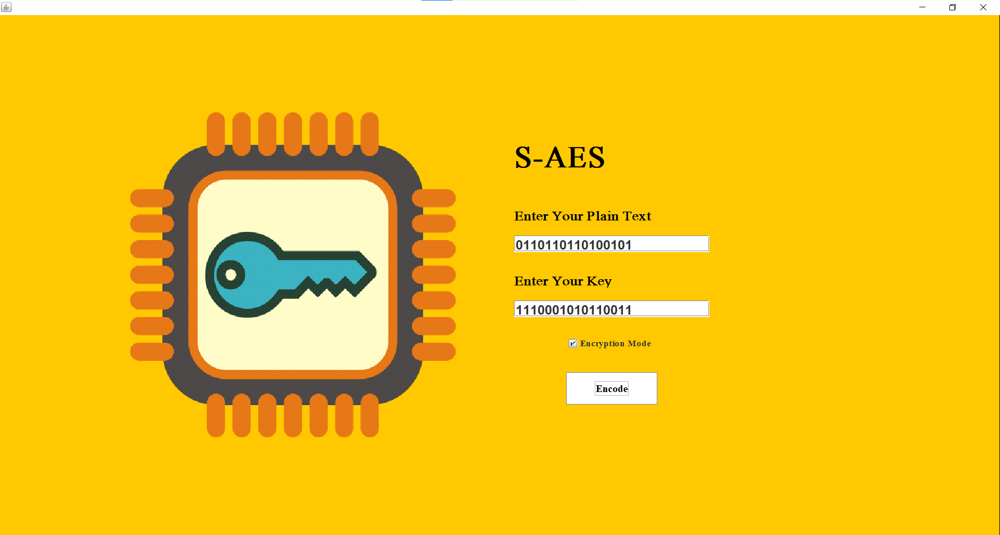
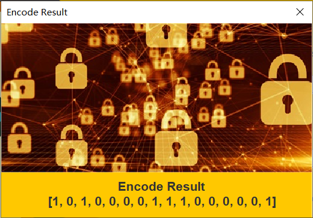
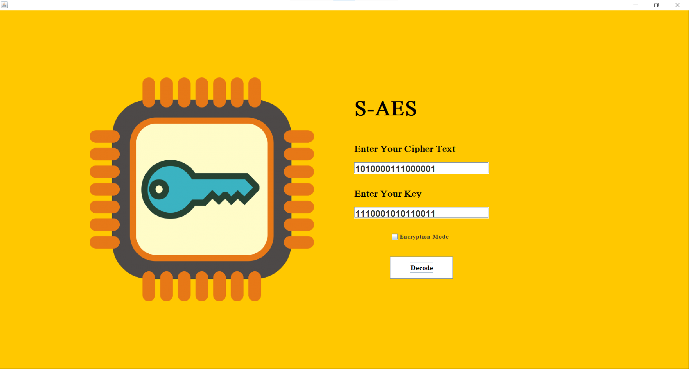
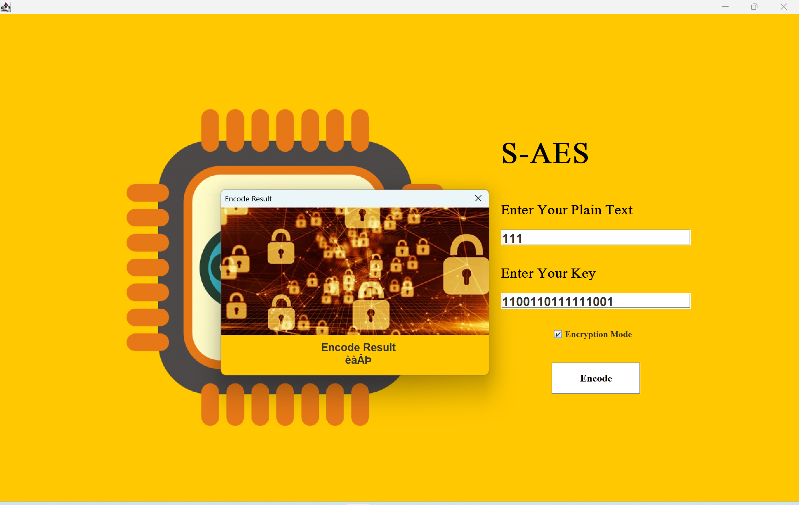
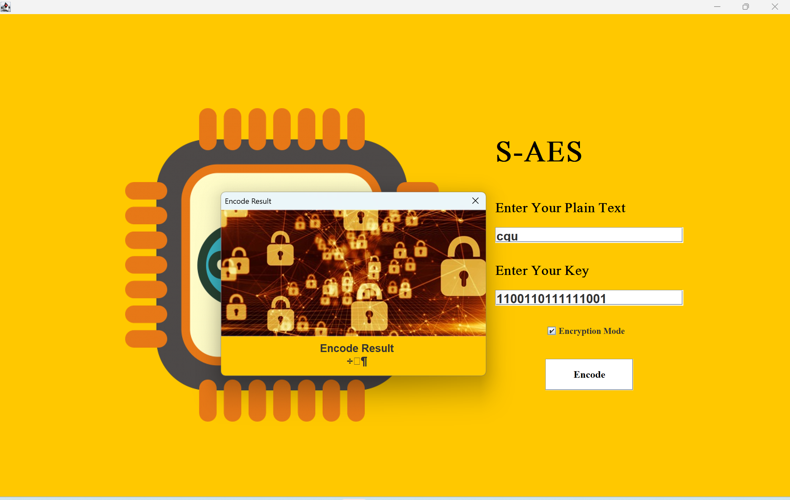

# InformationSecurity-S-AES
重庆大学大数据与软件学院-信息安全导论课程实验-S-AES算法的实现   
本实验是在胡海波老师指导之下，由朱清杨、邓怡杰完成

## 一、项目结构

- 项目根目录
    - src
        - src
            - S_AES.java (S-AES算法实现)
            - GF2_4.java (GF(2^4)算术实现)
            - StringBinaryTransfer.java (二进制字符串转换工具)
        - extend
            - MiddleMeetAttack.java (中间相遇攻击实现)
            - CBC_Mode.java (CBC工作模式实现)
        - test
            - Test.java (项目测试主类)
            - UnitTest.java (单元测试类)
        - page
            - S_AES_PAGE.java (加解密GUI页面)
            - ResultDialog.java (结果展示对话框)
            - imgs (GUI页面所使用的图片资源)
        -screenshots(项目截图) 

## 二、项目说明
### 1. 项目介绍
本实验是根据教科书《密码编码学于网络安全—原理与实践(第8版)》，附录D：简化AES 所完成，
使用Java实现S-AES（Simplified Advanced Encryption Standard）加密和解密。
S-AES是一个简化版本的高级加密标准（AES），它使用较短的密钥和固定数量的轮数，适用于资源有限的环境。   
加解密页面默认为加密，需要输入明文和密钥，点击“加密”按钮后，会弹出结果页面，显示加密后的密文。   
也可以选择解密，输入密文和密钥，点击“解密”按钮后，会弹出结果页面，显示解密后的明文。

### 2.输入输出格式
#### i.标准输入
按照实验基本要求的输入格式，输入明文和密钥，格式如下：
明文：16位二进制数   
密钥：16位二进制数

密文：16位二进制数   
密钥：16位二进制数

#### ii.标准输出
按照实验基本要求的输出格式，输出加密后的密文和解密后的明文，格式如下：   
密文：16位数组，每一位存储1位二进制数      
明文：16位数组，每一位存储1位二进制数

#### iii.拓展输入
当明文或者密文输入格式不符合标准输入格式时，都会视为拓展输入，此时将输入作为一个长为n的字符串，n为输入的长度，
将每一位字符先转化为8位的二进制ASCII码，再对连续的两个8位二进制的ASCII码视作16位的明文进行标准格式的加密，再将加密结果视作两个ASCII码然后转化为两个字符，如果字符数不为偶数，则在最后添加一个“ ”字符。
将每一位转化的结果进行组合，得到新的字符串即为密文。
> 但是密钥必须为严格的16位二进制数！
> 由于加密后的得到的ASCII码不可预测，有极大可能出现乱码

拓展输入情形包括：
1. 输入的密文或者明文为二进制数，但是位数不为16位
2. 输入的明文或者密文包含除了0和1以外的数字、字符

拓展输入输出案例如下：
当明文为“111”，密钥为“1100110111111001”时，结果为(乱码)：

当明文为“cqu”，密钥为“1100110111111001”时，结果为(乱码)：

当明文为“yuanshen”，密钥为“1100110111111001”时，结果为(乱码)：

当密文为“y‹­ŒeѦì”,密钥为“1100110111111001”时，结果为：

### 3.组间测试
本项目已经与魏鹏坤组、方珩组、熊孝宇组、林钰组完成交叉测试并通过
### 4.双重加密
#### i.双重加解密的实现
在完成基础的加解密功能之外，还完成了双重加密功能，使用32位的密钥，将密钥分为key1和key2，先使用key1加密明文，再使用key2加密密文，得到最终的加密结果
对此我们使用了下面的测试：
<pre>
<code>
plaintext1 = new int[]{1, 1, 0, 1, 1, 1, 0, 1, 1, 1, 0, 1, 0, 0,1, 0, 0};
int [] key1 = new int[]{1, 0, 0, 0, 1, 1, 1, 0, 1, 1, 1, 0, 0, 0, 0, 0}; 
int [] key2 = new int[]{0, 0, 0, 0, 0, 0, 1, 0, 0, 0, 1, 0, 0, 0, 0, 0}; 
int [] key32 = new int[]{1, 0, 0, 0, 1, 1, 1, 0, 1, 1, 1, 0, 0, 0, 0, 0, 0, 0, 0, 0, 0, 0, 1, 0, 0, 0, 1, 0, 0, 0, 0, 0};

//结果为：
ciphertext1=new int[][0, 0, 0, 1, 0, 0, 1, 0, 0, 0, 1, 0, 0, 1, 1, 0]
明文1加密后得到的中间状态为：[0, 1, 1, 0, 1, 1, 0, 1, 0, 0, 0, 1, 0, 0, 1, 0]
对中间状态再使用key2加密得到：[0, 0, 0, 1, 0, 0, 1, 0, 0, 0, 1, 0, 0, 1, 1, 0]
解密得到：[1, 1, 0, 1, 1, 1, 0, 1, 1, 1, 0, 1, 0, 0,1, 0, 0]
</code>
</pre>

#### ii.中间相遇攻击
在src/extend/MiddleMeetAttack.java文件中，我们组使用了同一组密钥对应的四组明密文对来进行中间相遇攻击，每次计算出一组明密文对满足的所有密钥对，
然后将四组得到的所有密钥对进行比较来得到唯一的密钥。
<pre>
<code>
第1组明文和密文：
[1, 1, 0, 1, 1, 1, 0, 1, 1, 1, 0, 1, 0, 0, 1, 0, 0]
[1, 1, 1, 0, 1, 0, 0, 0, 0, 0, 0, 1, 1, 1, 0, 1]
第2组明文和密文：
[1, 1, 0, 1, 1, 1, 0, 1, 1, 1, 0, 1, 0, 1, 1, 0, 0]
[0, 1, 1, 0, 0, 0, 1, 0, 0, 0, 1, 0, 1, 1, 0, 1]
第3组明文和密文：
[1, 1, 0, 1, 1, 1, 0, 1, 1, 1, 0, 1, 0, 0, 1, 1, 0]
[1, 0, 0, 0, 0, 0, 1, 0, 0, 0, 1, 0, 1, 0, 0, 1]
第4组明文和密文：
[1, 1, 0, 1, 1, 1, 0, 1, 1, 1, 0, 1, 0, 0, 1, 0, 1]
[0, 0, 0, 1, 0, 0, 1, 0, 0, 0, 1, 0, 0, 1, 1, 0]

每组明密文对有六万多对符合的密钥对
最终同时满足四组明密文对的密钥对为：
[0, 0, 0, 0, 0, 0, 1, 0, 0, 0, 1, 0, 0, 0, 0, 0, 1, 0, 0, 0, 1, 1, 1, 0, 1, 1, 1, 0, 0, 0, 0, 0]
</code>
</pre>

### 5.三重加密
与双重加密类似：使用了长为48位的密钥对明文进行三重加密，其中密钥key = key1 + key2 + key3
依次使用key1、key2、key3对明文、中间态、第二次加密得到的中间态进行加密，得到密文，解密过程则相反
对此我们使用了下面的测试来进行验证：
<pre>
<code>
plaintext1 = new int[]{1, 1, 0, 1, 1, 1, 0, 1, 1, 1, 0, 1, 0, 0,1, 0, 0};
int [] key1 = new int[]{1, 0, 0, 0, 1, 1, 1, 0, 1, 1, 1, 0, 0, 0, 0, 0}; 
int [] key2 = new int[]{0, 0, 0, 0, 0, 0, 1, 0, 0, 0, 1, 0, 0, 0, 0, 0}; 
int [] key3 = new int[]{0, 1, 0, 1, 0, 1, 0, 0, 1 ,0, 1, 1, 1, 0, 0, 0}; 
int [] key48 = new int[]{
            1, 0, 0, 0, 1, 1, 1, 0, 1, 1, 1, 0, 0, 0, 0, 0,
            0, 0, 0, 0, 0, 0, 1, 0, 0, 0, 1, 0, 0, 0, 0, 0,
            0, 1, 0, 1, 0, 1, 0, 0, 1 ,0, 1, 1, 1, 0, 0, 0
            };

//结果为：
三重加密的结果：[1, 0, 0, 0, 1, 0, 0, 1, 0, 0, 1, 0, 0, 0, 1, 1]
第一次加密：[0, 1, 1, 0, 1, 1, 0, 1, 0, 0, 0, 1, 0, 0, 1, 0]
第二次加密：[0, 0, 0, 1, 0, 0, 1, 0, 0, 0, 1, 0, 0, 1, 1, 0]
第三次加密：[1, 0, 0, 0, 1, 0, 0, 1, 0, 0, 1, 0, 0, 0, 1, 1]
解密得到：[1, 1, 0, 1, 1, 1, 0, 1, 1, 1, 0, 1, 0, 0,1, 0, 0]
</code>
</pre>

### 6.CBC工作模式
在src/extend/CBCMode.java中，完成了CBC工作模式的实现，实现将明文拓展至16的任意自然数倍然后进行加密

1. 选择一个16位的随机初始向量（IV）   
2. 将较长的明文消息分成固定大小的块（16位），然后使用S-AES算法来依次加密每个块。
3. 对于第一个块，将它与初始向量进行XOR操作，然后使用S-AES进行加密。加密后的结果成为下一个块的初始向量。
4. 对于后续的块，将明文块与前一个加密块进行XOR操作，然后使用S-AES进行加密。这个过程会一直持续，直到整个消息被加密。
5. 发送加密后的消息以及最后一个加密块给接收方。
6. 接收方知道初始向量，它可以根据相同的步骤解密消息，将每个块解密并将结果与前一个块的密文进行XOR操作。

下面是测试案例：
<pre>
<code>
// 设置初始化向量（IV） - 这是16位二进制数
int[] iv = {1, 0, 1, 0, 0, 1, 0, 1, 1, 0, 1, 0, 1, 0, 1, 0}; 

 // 设置密钥 - 这是16位二进制数
int[] key = {0, 1, 1, 0, 1, 0, 0, 1, 1, 0, 0, 1, 1, 1, 0, 0}; 

// 明文消息 - 这是32位二进制数 
int[] plaintext = {1, 0, 0, 1, 0, 1, 1, 0, 1, 1, 0, 0, 1, 0, 0, 1, 1, 0, 0, 1, 0, 0, 1, 0, 1, 1, 0, 1, 1, 0, 0, 1};

//结果：

加密后的密文: [1, 0, 0, 0, 1, 1, 1, 0, 0, 0, 1, 1, 1, 0, 0, 1, 1, 1, 1, 0, 1, 1, 0, 0, 1, 1, 1, 1, 0, 1, 1, 0]
解密后的明文: [1, 0, 0, 1, 0, 1, 1, 0, 1, 1, 0, 0, 1, 0, 0, 1, 1, 0, 0, 1, 0, 0, 1, 0, 1, 1, 0, 1, 1, 0, 0, 1]

</code>
</pre>
## 三、开发手册

### 1. 项目结构
- 项目根目录
    - src
        - src
            - S_AES.java (S-AES算法实现)
            - GF2_4.java (GF(2^4)算术实现)
            - StringBinaryTransfer.java (二进制字符串转换工具)
        - extend
            - MiddleMeetAttack.java (中间相遇攻击实现)
            - CBC_Mode.java (CBC工作模式实现)
        - test
            - Test.java (项目测试主类)
            - UnitTest.java (单元测试类)
        - page
            - S_AES_PAGE.java (加解密GUI页面)
            - ResultDialog.java (结果展示对话框)
            - imgs (GUI页面所使用的图片资源)
              -screenshots(项目截图)

### 2. S-AES算法实现
SDES算法实现位于`src/src/S_AES.java`中。这个文件包含了SDES算法的核心实现，包括加密和解密函数。
#### 1.类成员变量
s_box 和 Is_box：它们是S盒和逆S盒。
ignoredRCON1 和 ignoredRCON2：用于密钥扩展的常数向量。
MC_table 和 IMC_table：分别用于列混淆和逆列混淆。
#### 2.类成员方法
key_to_matrix：将16位数组转换为2x2的矩阵。   
to_binary：将十进制数字转化为4位二进制数，并在高位补零。   
matrix_to_binary：将2x2的矩阵转化为16位二进制数。   
bitwiseXOR：执行两个数组之间的异或操作。   
add_round_key：轮密钥加操作。   
substitute_bytes 和 sub_bytes：半字节替代操作。   
expand_key：密钥扩展操作。   
fun_g：用于密钥扩展的g函数。   
row_shift：行位移操作。   
MC：列混淆操作。   
encrypt：加密函数。   
decrypt：解密函数。   
double_encrypt 和 double_decrypt：双重加密和双重解密。   
triple_encrypt 和 triple_decrypt：三重加密和三重解密。   
#### 3.加密过程详解
##### 1.密钥拓展
在S-AES加密的开始，我们首先对初始的16位密钥进行扩展，以产生所需的子密钥。   
使用expand_key函数，将初始密钥分为两个8位的部分：W0和W1。   
使用函数 g（在代码中是fun_g）对W1进行处理，然后与W0进行异或操作得到W2。   
将W2与W1进行异或操作，得到W3。
使用函数g对w3进行处理，然后与w2进行异或操作，得到w4。   
将w4与w3进行异或操作，得到w5。
##### 2.初始轮密钥加
使用add_round_key函数，将明文与子密钥w0和w1进行异或操作。   
##### 3.第一轮
半字节替代（Byte Substitution）：使用s_box（S盒）进行半字节替代。
行位移（Row Shift）：对状态矩阵进行行位移操作。   
列混淆（Mix Columns）：使用MC函数和MC_table进行列混淆操作。   
轮密钥加（Add Round Key）：使用子密钥w2和w3。
##### 4.第二轮
半字节替代（Byte Substitution）：使用s_box（S盒）进行半字节替代。   
行位移（Row Shift）：对状态矩阵进行行位移操作。
轮密钥加（Add Round Key）：使用子密钥w4和w5。
##### 5.输出
最后的状态矩阵是加密的密文。   

## 四、用户指南
欢迎使用S-AES加解密工具！本实验是根据教科书《密码编码学于网络安全—原理与实践(第8版)》，附录D：简化AES 所完成，
使用Java实现S-AES（Simplified Advanced Encryption Standard）加密和解密。
### 1.工具简介
S-AES是一个简化版本的高级加密标准（AES），它使用较短的密钥和固定数量的轮数，适用于资源有限的环境。   
加解密页面默认为加密，需要输入明文和密钥，点击“加密”按钮后，会弹出结果页面，显示加密后的密文。   
也可以选择解密，输入密文和密钥，点击“解密”按钮后，会弹出结果页面，显示解密后的明文。
### 2.加密操作
1. 打开程序后，您将看到一个界面，初始状态为加密模式。
2. 在密文输入框中输入16位二进制密文。
3. 在密钥输入框中输入16位二进制密钥。
4. 点击“加密”按钮进行加密操作。
5. 加密结果将在弹出的结果页面中显示。
### 3.解密操作
1. 打开程序后，您将看到一个界面，初始状态为加密模式。
2. 点击切换为解密模式
3. 在密文输入框中输入16位二进制密文。
4. 在密钥输入框中输入16位二进制密钥。
5. 点击“解密”按钮进行解密操作。
6. 解密结果将在弹出的结果页面中显示。
### 4.注意事项
- 标准输入下：明文和密钥必须分别为16位和16位二进制数，不得包含除0和1以外的字符。
- 在拓展输入情况下，输入的密文或明文会被视为字符，转化为ASCII码进行处理。但密钥必须仍然是严格的16位二进制数。
### 5. 反馈与支持

如果您遇到任何问题或需要帮助，请随时联系我们。感谢您使用SDES算法加解密工具！

祝您使用愉快！